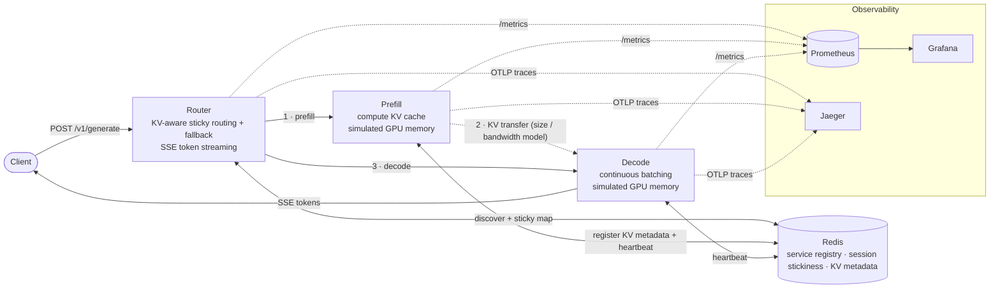
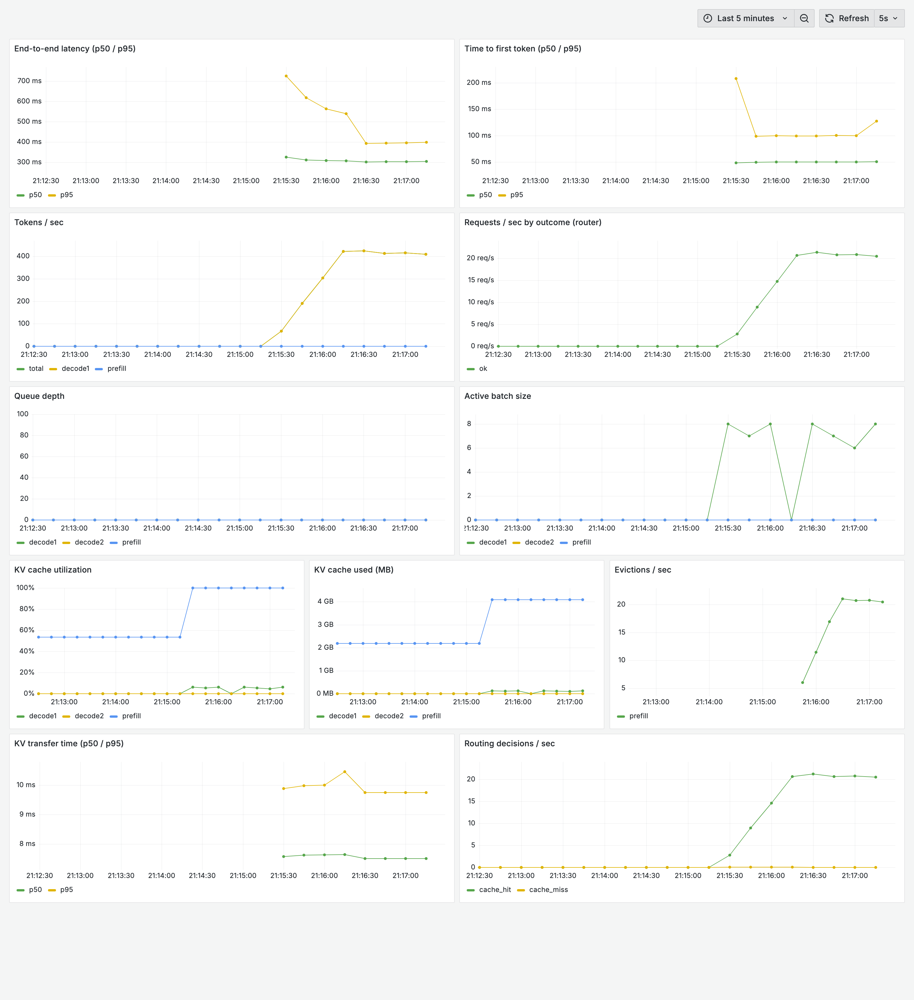
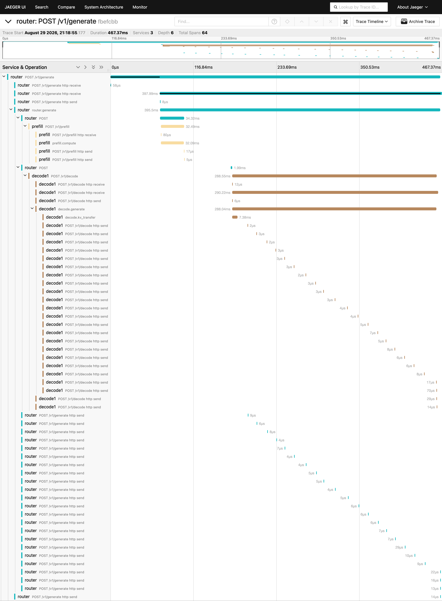
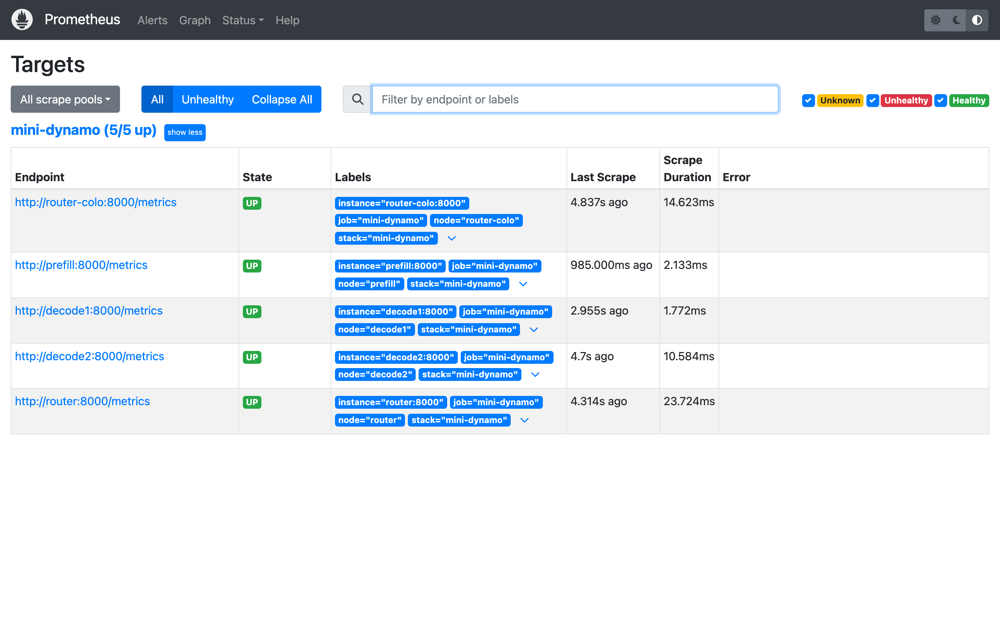

# Mini-Dynamo

A distributed LLM inference platform that demonstrates **disaggregated
prefill/decode** serving with **KV-cache-aware routing** and full
**observability**, modeled on the architecture of NVIDIA Dynamo. It runs
end-to-end on a laptop with **no GPU**: the model backend is simulated, faking
tokenization and token generation with realistic, configurable latency while
modeling GPU memory pressure, KV-cache eviction, and the cost of transferring a
KV cache between the prefill and decode stages.

## Why disaggregation?

In a monolithic ("colocated") server, prefill (compute-bound, processes the
whole prompt at once) and decode (latency-bound, one token at a time) share the
same GPU and interfere with each other. Disaggregation runs them as separate,
independently scalable services. The cost is that the KV cache produced by
prefill must be transferred to the decode worker. Mini-Dynamo makes that
tradeoff visible and measurable.

## Architecture



### Components

Each component is an independent module with a single responsibility.

| Module | Path | Responsibility |
|---|---|---|
| Router | `services/router` | Client entry point. KV-aware sticky routing by session id, least-loaded fallback, token streaming via SSE. |
| Prefill | `services/prefill` | Computes the KV cache (latency proportional to prompt length), allocates simulated GPU memory, registers KV metadata. Also hosts the colocated execution path. |
| Decode | `services/decode` | Transfers the KV cache in (overhead model), then streams tokens with continuous batching. |
| Memory simulator | `common/memory_sim.py` | Fixed GPU-memory pool with configurable eviction (LRU/FIFO/none) and utilization/eviction counters. |
| KV transfer | `common/kv_transfer.py` | `fixed_ms + size / bandwidth` cost model; zero in colocated mode. |
| Mock model | `common/mock_model.py` | Simulated tokenizer and token generator with tunable latency and jitter. |
| Batching | `common/batching.py` | Continuous-batching scheduler: new requests join the running batch each step. |
| Metrics / Telemetry | `common/metrics.py`, `common/telemetry.py` | Prometheus metrics and OpenTelemetry traces. |
| Shared state | `common/redis_client.py` | Service registry, sticky sessions, and KV metadata in Redis. |

## Quickstart

```bash
docker compose up -d --build      # or: make up
```

This starts Redis, a router, one prefill node, and two decode nodes
(`decode1`, `decode2`).

```bash
# health, and which backends registered themselves
curl -s localhost:8000/health | python3 -m json.tool
curl -s localhost:8000/backends | python3 -m json.tool

# stream a generation (-N to see tokens as they arrive)
curl -N -X POST localhost:8000/v1/generate \
  -H 'content-type: application/json' \
  -d '{"session_id":"s1","prompt":"the quick brown fox","max_tokens":32}'
```

Run the smoke test or the load client:

```bash
make smoke
python scripts/load_client.py --requests 50 --concurrency 8 --max-tokens 32
```

### Sticky routing and fallback

Repeated requests with the same `session_id` are pinned to the decode node that
first served them (a cache hit). If that node fails, the router falls back to
another live decode node and re-pins the session:

```bash
docker compose stop decode1     # simulate a node failure
curl -N -X POST localhost:8000/v1/generate \
  -H 'content-type: application/json' \
  -d '{"session_id":"s1","prompt":"still works?","max_tokens":16}'
```

## Configuration

Configuration is entirely environment-driven; see [`.env.example`](.env.example)
and [`common/config.py`](common/config.py).

| Variable | Default | Meaning |
|---|---|---|
| `MODE` | `disaggregated` | `disaggregated` or `colocated` |
| `GPU_MEMORY_MB` | `8192` | Simulated HBM per node |
| `KV_MB_PER_TOKEN` | `0.5` | KV footprint per token |
| `EVICTION_POLICY` | `lru` | `lru` / `fifo` / `none` |
| `KV_TRANSFER_BANDWIDTH_GBPS` | `25` | Prefill-to-decode link bandwidth |
| `KV_TRANSFER_FIXED_MS` | `2` | Fixed per-transfer overhead |
| `DECODE_MS_PER_TOKEN` | `12` | Per-token decode latency |
| `MAX_BATCH_SIZE` | `16` | Continuous-batch cap per decode node |

## API

| Endpoint | Service | Description |
|---|---|---|
| `POST /v1/generate` | router | Stream tokens (SSE). Body: `{session_id, prompt, max_tokens, stream}` |
| `GET /backends` | router | Live registry snapshot |
| `POST /v1/prefill` | prefill | Compute and register a KV cache |
| `POST /v1/decode` | decode | Transfer KV in and stream tokens |
| `GET /health`, `/stats`, `/metrics` | all | Health, memory stats, Prometheus metrics |

## Observability

The Compose stack includes a full telemetry pipeline, available once
`docker compose up` is running:

| Tool | URL | What it shows |
|---|---|---|
| Grafana | http://localhost:3000 | "Mini-Dynamo Overview" dashboard (auto-provisioned) |
| Prometheus | http://localhost:9090 | Raw metrics and scrape targets |
| Jaeger | http://localhost:16686 | Distributed traces |

Every service exposes Prometheus metrics at `/metrics` and exports
OpenTelemetry traces (OTLP) to Jaeger. A single generation produces one
connected trace spanning `router.generate → prefill.compute → decode.kv_transfer
→ decode.generate`, so the KV transfer between stages is visible as its own
span.

The dashboard covers p50/p95 end-to-end latency and time-to-first-token,
tokens/sec, requests/sec by outcome, queue depth, active batch size, KV cache
utilization and memory, evictions, KV transfer time, and routing decisions
(cache hit / miss / fallback).

### Live dashboards

Grafana "Mini-Dynamo Overview" under load — latency, throughput, continuous
batching, and KV cache memory reaching capacity with evictions kicking in:



A single request traced across all three stages in Jaeger
(router → prefill → decode), with the KV-transfer between stages shown as its
own span:



Prometheus scraping every service:



## Benchmark

The benchmark drives an identical workload against the disaggregated router and
a colocated router (prefill + decode in one worker, no KV transfer), and
measures the KV-transfer overhead directly from the decode nodes' metrics.

```bash
make bench
# or, explicitly:
docker compose run --rm --no-deps -v "$PWD:/work" -w /work prefill \
  python benchmark/run_benchmark.py --requests 60 --concurrency 8 --max-tokens 32
```

It writes a JSON result to `benchmark/results/` and prints a Markdown report.
A representative run is committed at
[`benchmark/results/sample_results.md`](benchmark/results/sample_results.md).

## Kubernetes

Manifests for a local cluster (kind / minikube / Docker Desktop) are under
[`k8s/`](k8s/). Prefill and decode run as StatefulSets with headless Services
for stable per-pod identity, so sticky routing and independent scaling work the
same as in Compose. See [`k8s/README.md`](k8s/README.md).

```bash
docker build -t mini-dynamo:latest .
kubectl apply -k k8s/
```

## Testing

```bash
pytest -q
```

## Repository layout

```
common/         shared library (config, models, memory_sim, mock_model,
                kv_transfer, batching, redis_client, telemetry, metrics)
services/       router/ · prefill/ · decode/   (FastAPI apps)
scripts/        smoke_test.sh · load_client.py
benchmark/      run_benchmark.py · report.py · results/
observability/  prometheus/ · grafana/ (datasources, dashboards)
k8s/            Kubernetes manifests (kustomize) + observability/
tests/          unit tests
```
